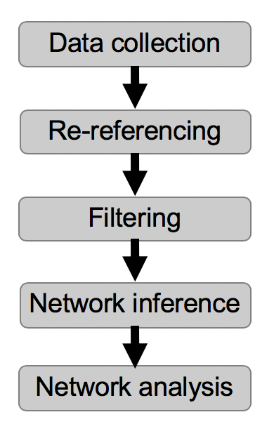

# AES-SIG-2018
**An Introduction to Network Analysis & EEG Interpretation**

This respository includes an example data set 

`AES_data.mat`

and an example script to analyze these data

`AES_data_analysis_pipeline.m`

Open the script and run it to implement specific choices for this data analysis pipeline:

The pipeline begins with a multielectrode recording and ends with a functional network, and analysis of that network. The pipeline is described in more detail in this [presentation at the AES SIG](https://github.com/Mark-Kramer/AES-SIG-2018/blob/master/AES_2018.pdf).

The analysis pipeline illustrates one example approach. There are many others.
